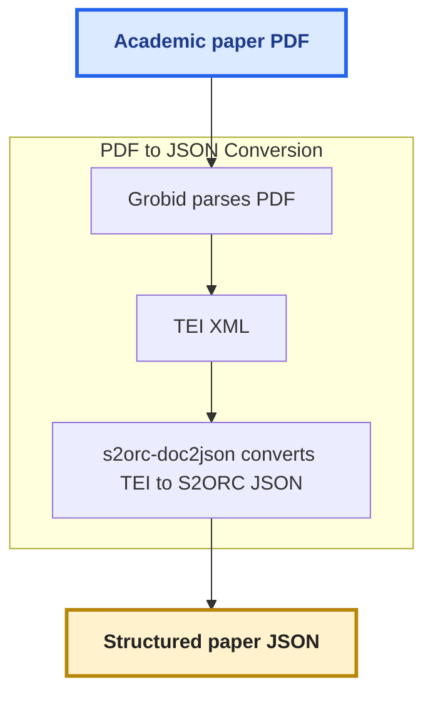
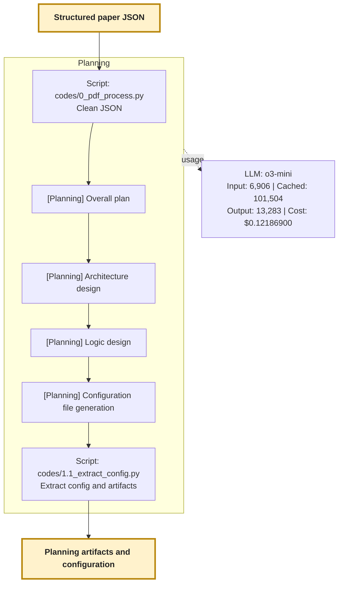
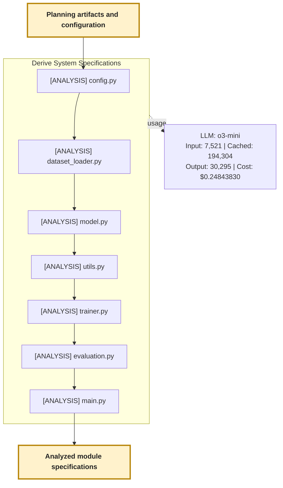
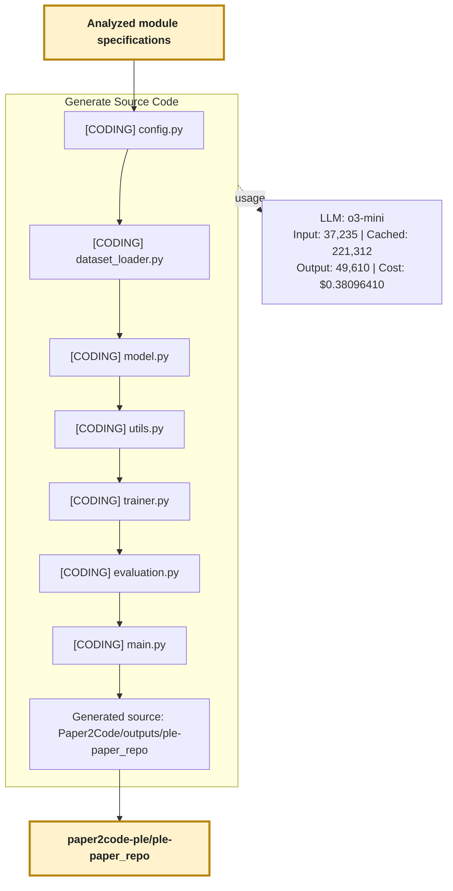
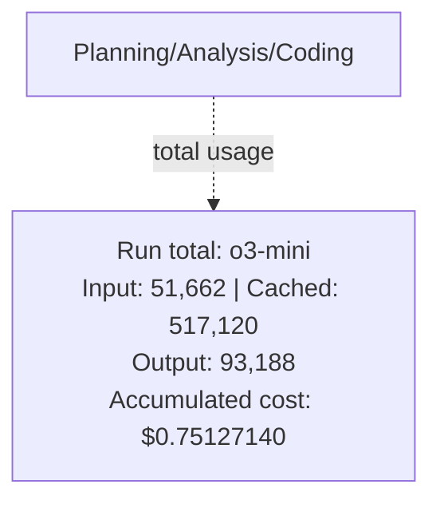
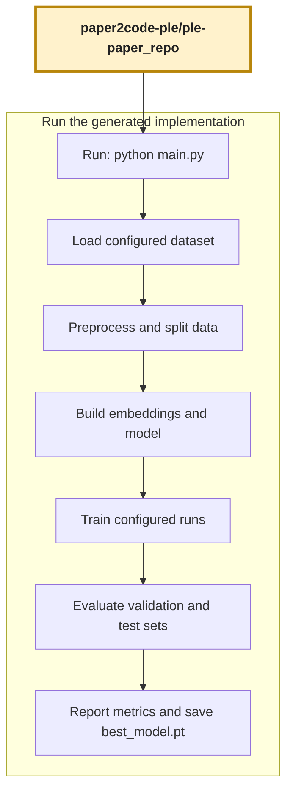

## Overview

This repository contains a paper-to-code project for [tabular deep learning with numerical feature embeddings, including Piecewise Linear Encoding (PLE)](https://arxiv.org/abs/2203.05556). The workspace includes the runnable experiment implementation and the planning, analysis, and code-generation artifacts used to develop it.

## Repository layout

| Path | Contents |
| --- | --- |
| `ple-paper_repo/` | Runnable Python experiment, YAML configuration, dataset utility, and California Housing CSV |
| `ple-paper/` | Planning documents, analysis and coding artifacts, generated responses and trajectories, and cost records |
| `requirements.txt` | Python package dependencies for the project |

The experiment implementation is in `ple-paper_repo/`. Its main modules are:

| File | Purpose |
| --- | --- |
| `config.yaml` | Dataset path and target column, preprocessing, embedding, model, training, and evaluation settings |
| `config.py` | Loads and validates the YAML configuration and provides configuration accessors |
| `create_dataset.py` | Fetches the California Housing dataset and writes `data/ca-housing.csv` |
| `dataset_loader.py` | Loads the configured CSV, preprocesses features, and creates train, validation, and test splits |
| `model.py` | Defines PLE and periodic feature embeddings and neural network backbones |
| `ple_demo.py` | Generates random numeric values, prints the 10-bin PLE boundaries, and displays sample encodings |
| `trainer.py` | Implements model training, validation, early stopping, and checkpoint saving |
| `evaluation.py` | Computes validation and test metrics, including ensemble results |
| `utils.py` | Provides seeding, metric calculations, logging, and parameter-count helpers |
| `main.py` | Connects configuration, data loading, model creation, training, and evaluation |

## Setup

Use Python 3.10 or later. From the repository root, create a virtual environment, activate it, and install the dependencies:

```bash
python3 -m venv .venv
source .venv/bin/activate
python -m pip install -r requirements.txt
```

## Dataset

The default experiment reads the CSV configured by `training.data_fp` in `ple-paper_repo/config.yaml`. The default path is `data/ca-housing.csv`, and the target column is `MedHouseVal`.

The dataset CSV is located in `ple-paper_repo/data/`. To regenerate it, run the script from the implementation directory:

```bash
cd ple-paper_repo
python create_dataset.py
```

Dataset generation uses scikit-learn's California Housing dataset fetcher and may need internet access if the dataset is not cached locally.

## Run the experiment

Run the entry point from the implementation directory so configuration loading and relative paths resolve as expected:

```bash
cd ple-paper_repo
python main.py
```

The experiment trains the number of models configured by `evaluation.num_seeds`, reports validation and test metrics, and writes the best model checkpoint as `best_model.pt` in the current working directory. Training can take some time with multiple seeds and up to `training.max_epochs` epochs. For a shorter development run, reduce those configuration values in `ple-paper_repo/config.yaml`.

## Run the PLE demo

The standalone demo generates 1,000 reproducible floating-point values between 0 and 100, encodes each value into a 10-element PLE vector, prints the bin boundaries, and displays a random five-row sample. Run it from the implementation directory:

```bash
cd ple-paper_repo
python ple_demo.py
```
Expected output
```
$ uv run python ple_demo.py
PLE bin boundaries: [0.0, 10.0, 20.0, 30.0, 40.0, 50.0, 60.0, 70.0, 80.0, 90.0, 100.0]
 numeric_value                                                                 ple
     37.226158   [1.0, 1.0, 1.0, 0.7226158380508423, 0.0, 0.0, 0.0, 0.0, 0.0, 0.0]
     30.207157 [1.0, 1.0, 1.0, 0.020715713500976562, 0.0, 0.0, 0.0, 0.0, 0.0, 0.0]
      0.166071 [0.016607077792286873, 0.0, 0.0, 0.0, 0.0, 0.0, 0.0, 0.0, 0.0, 0.0]
     27.482506   [1.0, 1.0, 0.7482506036758423, 0.0, 0.0, 0.0, 0.0, 0.0, 0.0, 0.0]
     65.012505   [1.0, 1.0, 1.0, 1.0, 1.0, 1.0, 0.5012504458427429, 0.0, 0.0, 0.0]
```

The equal-width bin boundaries are 0, 10, 20, ..., 100. The printed PLE column contains the raw bin activations for each sampled value.

## End-to-end paper-to-code workflow

These five diagrams split the paper-to-code process into slide-sized stages. Each output handoff is repeated as the next diagram's input. Agent stages follow [Paper2Code's run log](https://github.com/jimthompson5802/Paper2Code/blob/ple-paper/outputs/ple-paper_run_log.txt); scripts are identified separately.

### 1. PDF conversion



### 2. Paper2Code: Planning



### 3. Paper2Code: Analysis



### 4. Paper2Code: Coding



### Paper2Code: Overall



### 5. Run the generated implementation



## Configure another dataset

Edit the `training` section of `ple-paper_repo/config.yaml`:

```yaml
training:
  data_fp: "data/your-dataset.csv"
  target_column: "your_target_column"
```

Relative data paths are resolved from `ple-paper_repo/`; absolute paths are also accepted. The CSV must include the configured target column. The loader infers numerical and categorical input columns and applies the configured preprocessing.

## Project artifacts

The `ple-paper/` directory contains supporting material generated during the paper-to-code workflow. It includes planning artifacts, analysis summaries, coding artifacts, planning configuration and responses, per-file trajectories, and accumulated cost information. These support development and traceability; run the experiment from `ple-paper_repo/`.

Related resources:

* [Paper2Code outputs for the PLE paper](https://github.com/jimthompson5802/Paper2Code/tree/ple-paper/outputs) contains generated output artifacts associated with the paper-to-code workflow.
* [s2orc-doc2json](https://github.com/jimthompson5802/s2orc-doc2json) is the document conversion project used to convert scholarly articles from S2ORC into structured JSON required by the `Paper2Code` function.
