## Overview

This repository contains a paper-to-code project for tabular deep learning with numerical feature embeddings, including Piecewise Linear Encoding (PLE). The workspace includes the runnable experiment implementation and the planning, analysis, and code-generation artifacts used to develop it.

## Repository layout

| Path | Contents |
| --- | --- |
| `ple-paper_repo/` | Runnable Python experiment, YAML configuration, dataset utility, and California Housing CSV |
| `ple-paper/` | Planning documents, analysis and coding artifacts, generated responses and trajectories, and cost records |
| `requirements.txt` | Python package dependencies for the project |

The experiment implementation is in `ple-paper_repo/`. Its main modules are:

| File | Purpose |
| --- | --- |
| `config.yaml` | Dataset path and target column, preprocessing, embedding, model, training, and evaluation settings |
| `config.py` | Loads and validates the YAML configuration and provides configuration accessors |
| `create_dataset.py` | Fetches the California Housing dataset and writes `data/ca-housing.csv` |
| `dataset_loader.py` | Loads the configured CSV, preprocesses features, and creates train, validation, and test splits |
| `model.py` | Defines PLE and periodic feature embeddings and neural network backbones |
| `trainer.py` | Implements model training, validation, early stopping, and checkpoint saving |
| `evaluation.py` | Computes validation and test metrics, including ensemble results |
| `utils.py` | Provides seeding, metric calculations, logging, and parameter-count helpers |
| `main.py` | Connects configuration, data loading, model creation, training, and evaluation |

## Setup

Use Python 3.10 or later. From the repository root, create a virtual environment, activate it, and install the dependencies:

```bash
python3 -m venv .venv
source .venv/bin/activate
python -m pip install -r requirements.txt
```

## Dataset

The default experiment reads the CSV configured by `training.data_fp` in `ple-paper_repo/config.yaml`. The default path is `data/ca-housing.csv`, and the target column is `MedHouseVal`.

The dataset CSV is located in `ple-paper_repo/data/`. To regenerate it, run the script from the implementation directory:

```bash
cd ple-paper_repo
python create_dataset.py
```

Dataset generation uses scikit-learn's California Housing dataset fetcher and may need internet access if the dataset is not cached locally.

## Run the experiment

Run the entry point from the implementation directory so configuration loading and relative paths resolve as expected:

```bash
cd ple-paper_repo
python main.py
```

The experiment trains the number of models configured by `evaluation.num_seeds`, reports validation and test metrics, and writes the best model checkpoint as `best_model.pt` in the current working directory. Training can take some time with multiple seeds and up to `training.max_epochs` epochs. For a shorter development run, reduce those configuration values in `ple-paper_repo/config.yaml`.

## End-to-end paper-to-code workflow

The diagram below shows how a paper PDF is converted to structured JSON, processed by the Paper2Code agents on the `ple-paper` branch, and used to generate and run the implementation in this repository. The planning, analysis, and coding stage names follow [Paper2Code's run log](https://github.com/jimthompson5802/Paper2Code/blob/ple-paper/outputs/ple-paper_run_log.txt). Script steps are shown separately from agent stages.

```mermaid
flowchart TD
  pdf[Academic paper PDF]

  subgraph converter["s2orc-doc2json"]
    grobid["Grobid parses PDF into TEI XML"]
    s2json["Convert TEI XML to S2ORC JSON"]
    grobid --> s2json
  end

  pdf --> grobid
  s2json --> json["Structured paper JSON"]

  subgraph papercoder["Paper2Code on branch ple-paper"]
    clean["Script: codes/0_pdf_process.py<br/>Clean paper JSON"]

    subgraph planning["Planning agents"]
      plan["[Planning] Overall plan"]
      architecture["[Planning] Architecture design"]
      logic["[Planning] Logic design"]
      config["[Planning] Configuration file generation"]
      plan --> architecture --> logic --> config
    end

    extract["Script: codes/1.1_extract_config.py<br/>Extract configuration and planning artifacts"]

    subgraph analysis["Analysis agents"]
      a_config["[ANALYSIS] config.py"]
      a_loader["[ANALYSIS] dataset_loader.py"]
      a_model["[ANALYSIS] model.py"]
      a_utils["[ANALYSIS] utils.py"]
      a_trainer["[ANALYSIS] trainer.py"]
      a_eval["[ANALYSIS] evaluation.py"]
      a_main["[ANALYSIS] main.py"]
      a_config --> a_loader --> a_model --> a_utils --> a_trainer --> a_eval --> a_main
    end

    subgraph coding["Coding agents"]
      c_config["[CODING] config.py"]
      c_loader["[CODING] dataset_loader.py"]
      c_model["[CODING] model.py"]
      c_utils["[CODING] utils.py"]
      c_trainer["[CODING] trainer.py"]
      c_eval["[CODING] evaluation.py"]
      c_main["[CODING] main.py"]
      c_config --> c_loader --> c_model --> c_utils --> c_trainer --> c_eval --> c_main
    end

    generated["Generated source repository<br/>Paper2Code/outputs/ple-paper_repo"]

    clean --> plan
    config --> extract --> a_config
    a_main --> c_config
    c_main --> generated
  end

  json --> clean
  generated -->|"Use generated implementation here"| implementation["paper2code-ple/ple-paper_repo"]

  subgraph runtime["Run the generated implementation"]
    run["Run: python main.py"]
    load["Load configuration and dataset CSV"]
    prepare["Preprocess and split data"]
    build["Build feature embeddings and model"]
    train["Train models with validation and early stopping"]
    evaluate["Evaluate validation and test data; aggregate ensemble results"]
    results["Report metrics and save best_model.pt"]
    run --> load --> prepare --> build --> train --> evaluate --> results
  end

  implementation --> run
```



## Configure another dataset

Edit the `training` section of `ple-paper_repo/config.yaml`:

```yaml
training:
  data_fp: "data/your-dataset.csv"
  target_column: "your_target_column"
```

Relative data paths are resolved from `ple-paper_repo/`; absolute paths are also accepted. The CSV must include the configured target column. The loader infers numerical and categorical input columns and applies the configured preprocessing.

## Project artifacts

The `ple-paper/` directory contains supporting material generated during the paper-to-code workflow. It includes planning artifacts, analysis summaries, coding artifacts, planning configuration and responses, per-file trajectories, and accumulated cost information. These support development and traceability; run the experiment from `ple-paper_repo/`.

Related resources:

* [Paper2Code outputs for the PLE paper](https://github.com/jimthompson5802/Paper2Code/tree/ple-paper/outputs) contains generated output artifacts associated with the paper-to-code workflow.
* [s2orc-doc2json](https://github.com/jimthompson5802/s2orc-doc2json) is the document conversion project used to convert scholarly articles from S2ORC into structured JSON required by the `Paper2Code` function.
